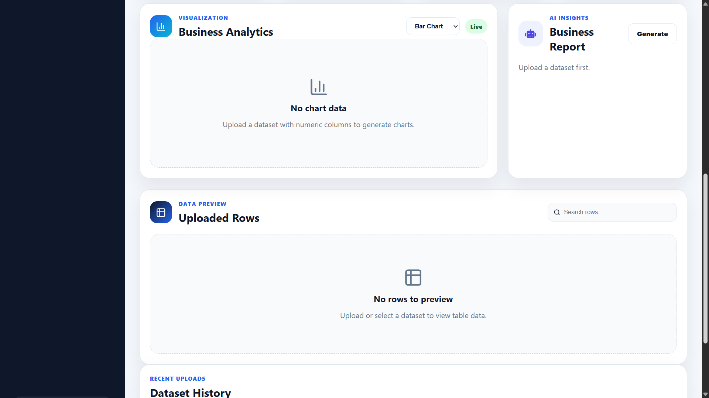
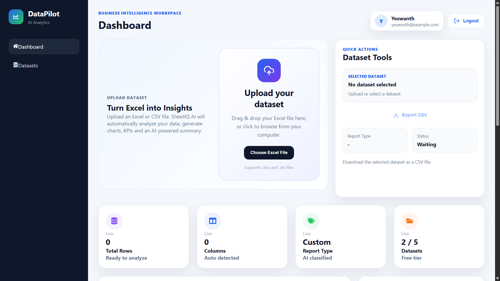
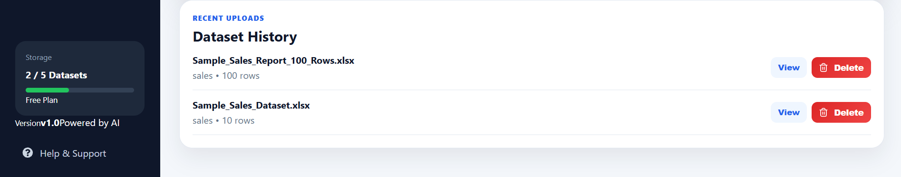

# 🚀 DataPilot AI

An AI-powered business intelligence dashboard that transforms Excel and CSV files into interactive charts, KPIs, and AI-generated insights.

🌐 **Live Demo:** :https://sheet-iq.vercel.app/

---

## 📖 Overview

DataPilot AI helps users analyze spreadsheet data without writing formulas or SQL queries.

Simply upload an Excel or CSV file and the application automatically:

- Parses the dataset
- Detects columns and data types
- Generates KPIs
- Creates interactive charts
- Produces an AI-powered executive summary
- Allows exporting the dataset as CSV

---

## ✨ Features

- 📁 Excel & CSV Upload
- 📊 Automatic Business Charts
- 📈 KPI Dashboard
- 🤖 AI Generated Executive Summary
- 🔍 Search & Pagination
- 📥 Export Dataset as CSV
- 🗂 Dataset History
- 🗑 Delete Uploaded Datasets
- 🔐 JWT Authentication
- 📱 Responsive UI

---

## 📸 Screenshots

### 🔐 Login Page


---

### 📤 Upload Dataset



---

### 📊 Dashboard



---

### 🗂 Dataset History



---

## 🛠 Tech Stack

### Frontend

- React
- Vite
- React Router
- Axios
- Recharts
- React Dropzone
- Lucide React
- React Icons

### Backend

- Node.js
- Express.js
- MongoDB Atlas
- Mongoose
- JWT Authentication
- Multer
- ExcelJS

### AI

- Groq API
- Llama 3.1

---

## 📂 Project Structure

```
DataPilot-AI
│
├── frontend
│   ├── src
│   ├── public
│   └── package.json
│
├── backend
│   ├── src
│   ├── controllers
│   ├── models
│   ├── routes
│   ├── services
│   └── package.json
│
└── README.md
```

---

## ⚙ Installation

### Clone Repository

```bash
git clone https://github.com/your-username/datapilot-ai.git
```

### Frontend

```bash
cd frontend
npm install
npm run dev
```

### Backend

```bash
cd backend
npm install
npm start
```

---

## 🔑 Environment Variables

### Backend (.env)

```env
PORT=5000
MONGO_URI=your_mongodb_connection
JWT_SECRET=your_secret
GROQ_API_KEY=your_api_key
```

### Frontend (.env)

```env
VITE_API_URL=http://localhost:5000/api
```

---

## 📊 How It Works

1. User uploads an Excel or CSV file.
2. Backend parses the file using ExcelJS.
3. Dataset is stored in MongoDB.
4. Dashboard generates KPIs and charts automatically.
5. AI generates an executive summary using Groq.
6. Users can search, paginate, export, or delete datasets.

---

## 🚀 Future Improvements

- PDF Report Export
- Multiple Chart Types
- Dark Mode
- Dashboard Filters
- Data Cleaning Suggestions
- AI Chat with Dataset
- Trend Analysis
- Role-Based Authentication

---

## 🎯 Learning Outcomes

This project helped me learn:

- MERN Stack Development
- REST API Design
- JWT Authentication
- File Uploads with Multer
- Excel Parsing
- MongoDB Data Modeling
- React Hooks
- Custom Hooks
- Reusable Components
- API Integration
- AI Integration
- Responsive UI Design

---

## 👨‍💻 Author

**Yeswanth Kumar**

---

## 📄 License

This project is licensed under the MIT License.
